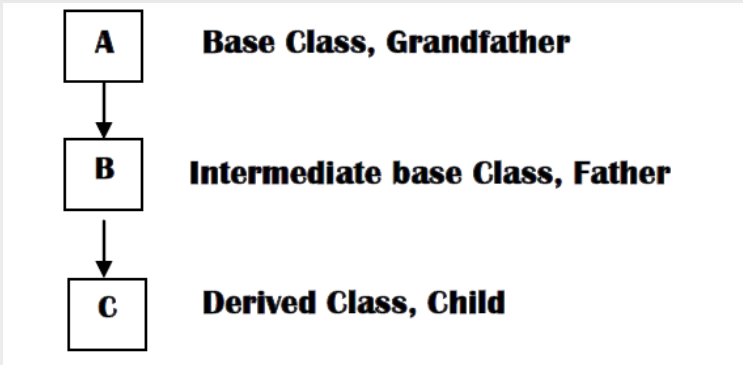
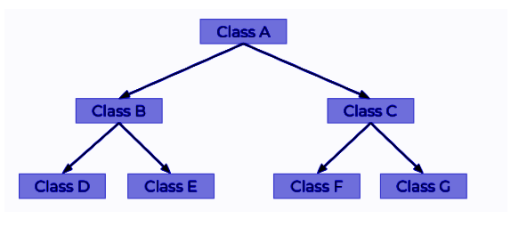
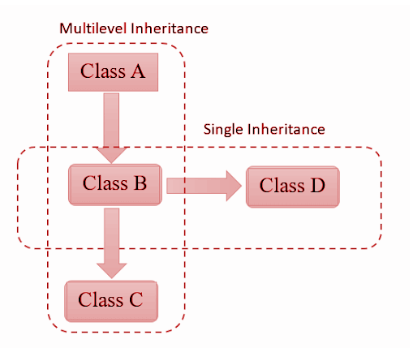

- [What Is Object-Oriented Programming?](#what-is-object-oriented-programming)
  - [OOP has several advantages](#oop-has-several-advantages)
  - [C++ What are Classes and Objects?](#c-what-are-classes-and-objects)
  - [Create a Class](#create-a-class)
    - [Friend Class C++](#friend-class-c)
    - [Virtual base class in C++](#virtual-base-class-in-c)
  - [Create a object](#create-a-object)
  - [Class Methods](#class-methods)
  - [Inside method](#inside-method)
  - [Outside method](#outside-method)
  - [Constructors](#constructors)
  - [Constructor Parameters](#constructor-parameters)
  - [destructor](#destructor)
  - [C++ Access Specifiers](#c-access-specifiers)
- [Encapsulation](#encapsulation)
  - [Encapsulation Advantage?](#encapsulation-advantage)
  - [Encapsulation Advantage?](#encapsulation-advantage-1)
- [C++ Inheritance](#c-inheritance)
  - [types of Inheritance in c++](#types-of-inheritance-in-c)
  - [Single inheritance](#single-inheritance)
  - [Multilevel inheritance](#multilevel-inheritance)
  - [Hierarchical inheritance](#hierarchical-inheritance)
  - [Multiple inheritance](#multiple-inheritance)
  - [Hybrid inheritance](#hybrid-inheritance)
  - [Advantage of  Inheritane](#advantage-of--inheritane)
- [C++ Polymorphism](#c-polymorphism)
  - [Compile time polymorphism](#compile-time-polymorphism)
    - [function overloading.](#function-overloading)
    - [Operator Overloading](#operator-overloading)
  - [Run time polymorphism](#run-time-polymorphism)
    - [Function overriding](#function-overriding)
    - [Virtual Function](#virtual-function)
    - [Friend Function](#friend-function)
- [Abstruction](#abstruction)

<!-- TOC end -->


<!-- TOC --><a name="what-is-object-oriented-programming"></a>
# What Is Object-Oriented Programming?

Object-oriented programming (OOP) is a programming paradigm based on the concept of objects, which can contain data and code.

<!-- TOC --><a name="oop-has-several-advantages"></a>
## OOP has several advantages

- OOP is faster and easier to execute.
- OOP provides a clear structure for the programs.
- OOP helps to keep the C++ code DRY "Don't Repeat Yourself", and makes the code easier to maintain, modify and debug.
- OOP makes it possible to create full reusable applications with less code and shorter development time.

<!-- TOC --><a name="c-what-are-classes-and-objects"></a>
## C++ What are Classes and Objects?

<b>Object</b> : object is a class type variable.<br/>
<b>class</b>  : A class is a  template form which individual object can be created.</br>

Look at the following illustration to see the difference between class and objects:</br>


</br>
another example:


<!-- TOC --><a name="create-a-class"></a>
## Create a Class

```
class Student {      
  public:   // Access specifier         
    int age;      
    string Name; 
    int id;
};
```
<!-- TOC --><a name="friend-class-c"></a>
### Friend Class C++
A friend class can access private and protected members of other classes in which it is declared as a friend. It is sometimes useful to allow a particular class to access private and protected members of other classes. For example, a LinkedList class may be allowed to access private members of Node.</br>

We can declare a friend class in C++ by using the friend keyword.
```
#include <iostream>
using namespace std;
 
class Myclass {
private:
    int private_variable;
 
protected:
    int protected_variable;
 
public:
    Myclass(){
        private_variable = 100;
        protected_variable = 990;
    }
 
    // friend class declaration
    friend class Friend;
};

class Friend {
public:
    void display(Myclass &t){
        cout << "The value of Private Variable = "
             << t.private_variable << endl;
        cout << "The value of Protected Variable = "
             << t.protected_variable<<endl;
    }
};

int main(){
    Myclass g;
    Friend fri;
    fri.display(g);
    return 0;
}
```
<!-- TOC --><a name="virtual-base-class-in-c"></a>
### Virtual base class in C++
Virtual base classes are used in virtual inheritance in a way of preventing multiple “instances” of a given class appearing in an inheritance hierarchy when using multiple inheritances.</br> 

Need for Virtual Base Classes: Consider the situation where we have one class A . This class A is inherited by two other classes B and C. Both these class are inherited into another in a new class D.
</br>
As we can see from the figure that data members/function of class A are inherited twice to class D. One through class B and second through class C. When any data / function member of class A is accessed by an object of class D, ambiguity arises as to which data/function member would be called? One inherited through B or the other inherited through C. This confuses compiler and it displays error. </br>
why need virtual class?
```
#include <iostream> 
using namespace std; 
  
class A { 
public: 
    void show() 
    { 
        cout << "Hello form A \n"; 
    } 
}; 
  
class B : public A { 
}; 
  
class C : public A { 
}; 
  
class D : public B, public C { 
}; 
  
int main() 
{ 
    D object; 
    object.show(); 
} 

OUTPUT : Compile Error.(show() is ambiguous)
```

solve this problem need virtual class.
```
#include <iostream> 
using namespace std; 
  
class A { 
public: 
    void show() 
    { 
        cout << "Hello from A \n"; 
    } 
}; 
  
class B : public virtual A { 
}; 
  
class C : public virtual A { 
}; 
  
class D : public B, public C { 
}; 
  
int main() 
{ 
    D object; 
    object.show(); 
} 
```


<b>Explanation:</b> The class A has just one data member a which is public. This class is virtually inherited in class B and class C. Now class B and class C use the virtual base class A and no duplication of data member a is done; Classes B and C share a single copy of the members in the virtual base class A.

<!-- TOC --><a name="create-a-object"></a>
## Create a object
```
class student{
public:
  int age,id;
  string name;
};

 int main(){
     student alice;
     alice.age=20; alice.id=1; alice.name="alice";
     cout<<"student name = "<<alice.name<<endl;
     cout<<"student age = "<<alice.age<<endl;
     cout<<"student id = "<<alice.id<<endl;

 }
```

<!-- TOC --><a name="class-methods"></a>
## Class Methods

Methods are functions that belongs to the class.</br>
There are two ways to define functions that belongs to a class:

- Inside class definition
- Outside class definition

<!-- TOC --><a name="inside-method"></a>
## Inside method

```
class student{
public:
  int age,id;
  string name;
  //display function is method.
  void display(){
    cout<<"student name = "<<name<<endl;
    cout<<"student age = "<<age<<endl;
    cout<<"student id = "<<id<<endl;
  }
};

int main(){
     student alice;
     alice.age=20; alice.id=1; alice.name="alice";
     alice.display();
}
```

<!-- TOC --><a name="outside-method"></a>
## Outside method

This is done by specifiying the name of the class, followed the scope resolution :: operator, followed by the name of the function:</br>

```
class student {
public:
  int age, id;
  string name;
  void display();
};

//outside method display;
void student::display() {
  cout << "student name = " << name << endl;
  cout << "student age = " << age << endl;
  cout << "student id = " << id << endl;
}

int main() {
  student alice;
  alice.age = 20; alice.id = 1; alice.name = "alice";
  alice.display();

}
```

<!-- TOC --><a name="constructors"></a>
## Constructors

A constructor in C++ is a special method that is automatically called when an object of a class is created.</br>
A constructor has no return type.To create a constructor, use the same name as the class, followed by parentheses ():</br>

```
class student{
public:
  int age,id;
  string name;
  student(){ // constructor
    cout<<"constructor"<<endl;
  }
};
 int main(){
     student alice;
 }
```

<!-- TOC --><a name="constructor-parameters"></a>
## Constructor Parameters

Constructors can also take parameters (just like regular functions), which can be useful for setting initial values for attributes.

```
class student{
public:
  int age,id;
  string name;
  student(int ag,int i,string nm){//Constructor Parameters
      age=ag; id=i; name=nm;
  }
};

int main(){
     student alice(20,1,"alice");
     cout<<"student name = "<<alice.name<<endl;
     cout<<"student age = "<<alice.age<<endl;
     cout<<"student id = "<<alice.id<<endl;

 }
```

<!-- TOC --><a name="destructor"></a>
## destructor

A destructor works opposite to constructor; it destructs the objects of classes. It can be defined only once in a class. Like constructors, it is invoked automatically.</br>

A destructor is defined like constructor. It must have same name as class. But it is prefixed with a tilde sign (~).</br>
<b>Note: C++ destructor cannot have parameters. Moreover, modifiers can't be applied on destructors.</b>

```
#include <iostream>  
using namespace std;  
class Employee  
 {  
   public:  
        Employee()    //constructor
        {    
            cout<<"Constructor called"<<endl;    
        }    
        ~Employee()     // destructor
        {    
            cout<<"Destructor called"<<endl;    
        }  
        void display(){
          cout<<"called display function"<<endl;
        }
};  
int main(void) {  
    Employee e1; 
    e1.display();

    return 0;  
} 

Output:
       Constructor called
       called display function
       Destructor called
 
```

<!-- TOC --><a name="c-access-specifiers"></a>
## C++ Access Specifiers

In C++, there are three access specifiers:</br>

- <b>public : </b>members are accessible from outside the class.
- <b>private : </b>members cannot be accessed (or viewed) from outside the class.
- <b>protected : </b>members cannot be accessed from outside the class, however, they can be accessed in inherited classes.

```
class MyClass {
  public:    // Public access specifier
    int x;   // Public attribute
  private:   // Private access specifier
    int y;   // Private attribute
};

int main() {
  MyClass myObj;
  myObj.x = 25;  // Allowed (public)
  myObj.y = 50;  // Not allowed (private)
  return 0;
}
```

<b><h1></h>Note : </h1></b> By default, all members of a class are private if you don't specify an access specifier:

```
class MyClass {
  int x;   // Private attribute
  int y;   // Private attribute
};
```

<!-- TOC --><a name="encapsulation"></a>
# Encapsulation

The meaning of Encapsulation, is to make sure that "sensitive" data is hidden from users. To achieve this, you must declare class variables/attributes as private (cannot be accessed from outside the class).that is known data hiding. If you want others to read or modify the value of a private member, you can provide public get and set methods.

```
class Employee{
private:
 int salary;
public:
  //getter method
 void setter(int s){
      salary=s;
 }
  //setter method
 int getSalary(){
  return salary;
 }
};
int main(){
 Employee obj;
 obj.setter(50000);
 int s=obj.getSalary();
 cout<<s<<endl;
}
```

<!-- TOC --><a name="encapsulation-advantage"></a>
## Encapsulation Advantage?

- It is considered good practice to declare your class attributes as private (as often as you can). Encapsulation ensures better control of your data, because you (or others) can change one part of the code without affecting other parts.
- Increased security of data.

<!-- TOC --><a name="encapsulation-advantage-1"></a>
## Encapsulation Advantage?

- Code reusability.
- Application development time is less.
- Application take less memory.
- Application executiontime is less.

<!-- TOC --><a name="c-inheritance"></a>
# C++ Inheritance

In C++, it is possible to inherit attributes and methods from one class to another. We group the "inheritance concept" into two categories: </br>

- <b>derived class</b> (child) - the class that inherits from another class.
- <b>base class</b> (parent) - the class being inherited from
</br>

To inherit from a class, use the : symbol.In the example below, the Car class (child) inherits the attributes and methods from the Vehicle class (parent):

```
#include<bits/stdc++.h>
using namespace std;
class Vehicle{
public:
 string brand="ford";
 void fun(){
  cout<<"Vehicle class"<<endl;
 }
};
class car: public Vehicle{
public:
 string model="Mustang";
};
int main(){
 car obj;
 obj.fun();
 cout<<obj.brand<<endl;
 cout<<obj.model<<endl;
}
```

<!-- TOC --><a name="types-of-inheritance-in-c"></a>
## types of Inheritance in c++

1. Single inheritance
2. Multilevel inheritance
3. Hierarchical inheritance
4. Multiple inheritance
5. Hybrid inheritance

<!-- TOC --><a name="single-inheritance"></a>
## Single inheritance

The inheritance in which a single derived class is inherited from a single base class is known as the Single Inheritance. It is the simplest among all the types of inheritance since it does not include any kind of inheritance combination or different levels of inheritance.</br>


```
class base_class{
//code
};

class derived_class : public(access_modifier) base_class{
//code
};

int main()
{
base_class object_1;
derived_class object_2;
//code
}
```

<!-- TOC --><a name="multilevel-inheritance"></a>
## Multilevel inheritance

A class can also be derived from one class, which is already derived from another class.</br>



In the following example, MyGrandChild is derived from class MyChild (which is derived from MyClass).

```
// Base class (parent)
class MyClass {
  public:
    void myFunction() {
      cout << "parent class." ;
    }
};

// Derived class (child)
class MyChild: public MyClass {
};

// Derived class (grandchild)
class MyGrandChild: public MyChild {
};

int main() {
  MyGrandChild myObj;
  myObj.myFunction();
  return 0;
}
```

<!-- TOC --><a name="hierarchical-inheritance"></a>
## Hierarchical inheritance

Hierarchical Inheritance in C++ refers to the type of inheritance that has a hierarchical structure of classes. A single base class can have multiple derived classes, and other subclasses can further inherit these derived classes, forming a hierarchy of classes.



```
Class Parent  {  
    statement(s);  
};  
Class Derived1: public Parent {  
    statement(s);  
};  
Class Derived2: public Parent  {  
    statement(s);  
};  
class newderived1: public Derived1  {  
    statement(s);  
};  
class newderived2: public Derived2  {  
    statement(s);  
};  
```

<!-- TOC --><a name="multiple-inheritance"></a>
## Multiple inheritance

Multiple Inheritance is a feature of C++ where a class can inherit from more than one classes.</br>
A class can also be derived from more than one base class, using a comma-separated list:

```
// Base class
class father {
  public:
    void myFunction() {
      cout << "Some content in father class." ;
    }
};

// Another base class
class mother {
  public:
    void myOtherFunction() {
      cout << "Some content in mother class." ;
    }
};

// Derived class
class child: public father, public mother {
};

int main() {
  MyChildClass myObj;
  myObj.myFunction();
  myObj.myOtherFunction();
  return 0;
}
```

<!-- TOC --><a name="hybrid-inheritance"></a>
## Hybrid inheritance

Combining various types of inheritance like multiple, simple, and hierarchical inheritance is known as hybrid inheritance.</br>

</br>

Syntax code of the above example

```
Class A  {  
statement(s)  
}:  

Class B: public A  {  
statement(s);  
};  

Class C  {  
statement(s);  
};  

Class D: public B, public C   {  
statement(s);  
};  
```

<!-- TOC --><a name="advantage-of-inheritane"></a>
## Advantage of  Inheritane

- Code reusability
- Application development time is less
- Application take less memory
- Application execution time is less
</br>

<!-- TOC --><a name="c-polymorphism"></a>
# C++ Polymorphism

Polymorphism means "many forms", and it occurs when we have many classes that are related to each other by inheritance.</br>
Type of 2 Polymorphism:

- Compile time polymorphism
- Run time polymorphism

<!-- TOC --><a name="compile-time-polymorphism"></a>
## Compile time polymorphism
1. function overloading.
2. Operator Overloading
<!-- TOC --><a name="function-overloading"></a>
### function overloading.
Function overloading is a feature of object-oriented programming where two or more functions can have the same name but different parameters. When a function name is overloaded with different jobs it is called Function Overloading.
```
#include <bits/stdc++.h>
using namespace std;
 void add(int a, int b){
  cout << "sum = " << (a + b)<<endl;
}
void add(int a, int b,int c){
  cout << "sum = " << (a + b+c)<<endl;
}
 
void add(double a, double b){
    cout <<"sum = " << (a + b)<<endl;
}

int main(){
    add(10, 2);
    add(10, 2,4);
    add(5.3, 6.2); 
    return 0;
}

Output : 
          sum = 12
          sum = 16
          sum = 11.5
```


<!-- TOC --><a name="operator-overloading"></a>
### Operator Overloading
Operator overloading is a feature in object-oriented programming languages that allows you to define and use operators (like +, -, *, /, ==, etc.) for user-defined data types or objects. In other words, it allows you to redefine the behavior of operators when applied to instances of your own classes.classes where arithmetic operators may be overloaded are Complex Numbers, Fractional Numbers, Big integers, etc.
```
#include <iostream>
using namespace std;
class call{
public:
	int n;
	call(int x){
		n=x;
	}
	void operator --(){
		n = n - 5;
	}
	void operator ++(){
		n = n + 5;
	}
	void Display() {
		cout << n<<endl;
	}
};
int main(){
	call c(10);
	--c;
	c.Display();
	c.n=10;
	++c;
	c.Display();
	return 0;
}
```
Example two complex number add:
```
#include <iostream>
using namespace std;
 
class Complex {
private:
    int real, imag;
 
public:
    Complex(int r = 0, int i = 0)
    {
        real = r;
        imag = i;
    }
    Complex operator+(Complex obj)
    {
        Complex res;
        res.real = real + obj.real;
        res.imag = imag + obj.imag;
        return res;
    }
    void print() { cout << real << " + i" << imag << '\n'; }
};
 
int main()
{
    Complex c1(10, 5), c2(2, 4),c4(5,6);
    Complex c4 = c1 + c2 + c4;
    c3.print();
}
```


<!-- TOC --><a name="run-time-polymorphism"></a>
## Run time polymorphism
- function overriding.
- Virtual Function
  
<!-- TOC --><a name="function-overriding"></a>
### Function overriding
If derived class defines same function as defined in its base class, it is known as function overriding in C++. It is used to achieve runtime polymorphism. It enables you to provide specific implementation of the function which is already provided by its base class.

```
#include <iostream>
using namespace std;

class Parent {
public:
    void display() {
        cout << "Base Function" << endl;
    }
};

class Child : public Parent {
public:
    void display() {
        cout << "Derived Function" << endl;
        Parent::display();
    }
};

int main()
{
    Child Child_Derived;
    Child_Derived.display();
    return 0;
}
```
<!-- TOC --><a name="virtual-function"></a>
### Virtual Function
A virtual function is declared by keyword virtual. The return type of virtual function may be int, float, void.

A virtual function is a member function in the base class. We can redefine it in a derived class. It is part of run time polymorphism. The declaration of the virtual function must be in the base class by using the keyword virtual. A virtual function is not static. </br>

<b>Rules of Virtual Function</b>

- Virtual functions must be members of some class.
- Virtual functions cannot be static members.
- They are accessed through object pointers.
- They can be a friend of another class.
- A virtual function must be defined in the base class, even though it is not used.
- The prototypes of a virtual function of the base class and all the derived classes must be identical. If the two functions with the same name but different prototypes, C++ will consider them as the overloaded functions.
- We cannot have a virtual constructor, but we can have a virtual destructor
- Consider the situation when we don't use the virtual keyword.

```
#include<iostream>
using namespace std; 
 
class Add
{ 
public: 
    virtual void print () 
    { int a=20, b=30;
     cout<< " base class Action is:"<<a+b <<endl;
      } 
 
    void show () 
    { cout<< "show base class" <<endl; } 
}; 
 
class Sub: public Add 
{ 
public: 
    void print () 
    { int x=20,y=10;
      
    cout<< " derived class Action:"<<x-y <<endl; } 
 
    void show () 
    { cout<< "show derived class" <<endl; } 
}; 
 
int main() 
{ 
    Add *aptr; 
    Sub s; 
    aptr = &s; 
     
    //virtual function, binded at runtime (Runtime polymorphism) 
    aptr->print(); 
     
    // Non-virtual function, binded at compile time 
    aptr->show(); 
 
    return 0; 
} 
```
<!-- TOC --><a name="friend-function"></a>
### Friend Function
Like a friend class, a friend function can be granted special access to private and protected members of a class in C++. They are the non-member functions that can access and manipulate the private and protected members of the class for they are declared as friends.</br>
A friend function can be:
1. A global function
2. A member function of another class


```
#include <iostream>
using namespace std;
 
class base {
private:
    int private_variable;
 
protected:
    int protected_variable;
 
public:
    base()
    {
        private_variable = 10;
        protected_variable = 99;
    }
     
      // friend function declaration
    friend void friendFunction(base& obj);
};
 
 
// friend function definition
void friendFunction(base& obj)
{
    cout << "Private Variable: " << obj.private_variable
         << endl;
    cout << "Protected Variable: " << obj.protected_variable;
}
 
int main()
{
    base object1;
    friendFunction(object1);
 
    return 0;
}
```

<!-- TOC --><a name="abstruction"></a>
# Abstruction
Abstruction is the process of hiding the implemantation details ans showing only the functionality to the user.
- Object can not be created. 
- We can create pointer and reference of base class points.
- it can have constructor. 
</br>

<b>Types of Abstraction:</b></br>
<b>Data abstraction</b> – This type only shows the required information about the data and hides the unnecessary data.</br>
 <b>Control Abstraction</b> – This type only shows the required information about the implementation and hides unnecessary information.
```
#include<bits/stdc++.h>
using namespace std;
class MobileMessage{
public:
	 void call(){
	 	cout<<"Called call function"<<endl;
	 }
	virtual void sendMessage()=0;
};
class alice: public MobileMessage{
public:
	void sendMessage(){
	 	cout<<"alice"<<endl;
	 }
};
class bob: public MobileMessage{
public:
	void sendMessage(){
	 	cout<<"bob"<<endl;
	 }
};
int main(){
	 MobileMessage *ob;
     alice a;
     bob b;
     ob=&a;
     ob->sendMessage();
     ob=&b;
     ob->sendMessage();
     return 0;
}
```


