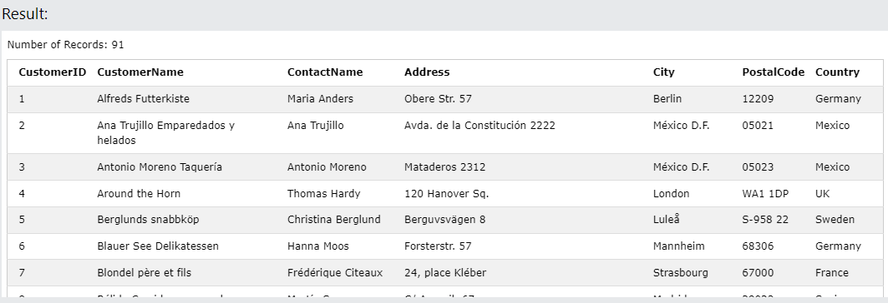
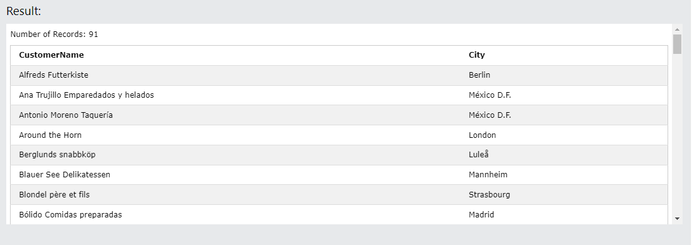
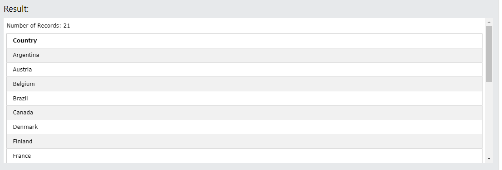
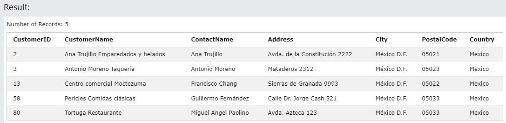
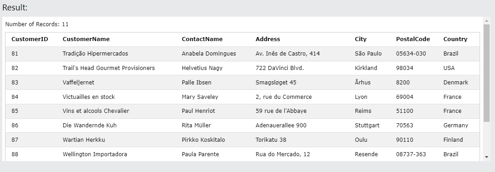

# SQL

SQL stands for Structured Query Language.<br>
SQL lets you access and manipulate databases<br>
What Can SQL do?

1. SQL can execute queries against a database.
2. SQL can retrieve data from a database.
3. SQL can insert records in a database.
4. SQL can update records in a database.
5. SQL can delete records from a database.
6. SQL can create new databases.
7. SQL can create new tables in a database.
8. SQL can create stored procedures in a database.
9. SQL can create views in a database.
10. SQL can set permissions on tables, procedures, and views.<br>

Some of The Most Important SQL Commands.

1. SELECT - extracts data from a database.
2. UPDATE - updates data in a database.
3. DELETE - deletes data from a database
4. INSERT INTO - inserts new data into a database
5. CREATE DATABASE - creates a new database
6. ALTER DATABASE - modifies a database
7. CREATE TABLE - creates a new table
8. ALTER TABLE - modifies a table
9. DROP TABLE - deletes a table
10. CREATE INDEX - creates an index (search key)
11. DROP INDEX - deletes an index

# SQL SELECT Statement

The SELECT statement is used to select data from a database.<br>
<b>All data select from database:</b>

```
SELECT * FROM Customers;
```

<br>
Here Customers is a database table.<br>
Select some columns of Database table.

```
SELECT CustomerName, City FROM Customers;
```

<br>
Here, CustomerName, City are columns of Customers table.

# SQL SELECT DISTINCT Statement

The SELECT DISTINCT statement is used to return only distinct (different) values.<br>
<b>Syntax</b>

```
SELECT DISTINCT column1, column2, ...
FROM table_name;
```

Example.<br>

```
SELECT DISTINCT Country FROM Customers;
```

<br>

# SQL WHERE Clause

The WHERE clause is used to filter records.

It is used to extract only those records that fulfill a specified condition.<br>
<b>Syntax</b>

```
SELECT column1, column2, ...
FROM table_name
WHERE condition;
```

<b>Example.</b>

```
SELECT * FROM Customers
WHERE Country='Mexico';
```

<br>

Example.<br>

```
SELECT * FROM Customers
WHERE CustomerID > 80;
```

output.<br>
<br>

# SQL ORDER BY Keyword

The ORDER BY keyword is used to sort the result-set in ascending or descending order.<br>
<b>Syntax.</b>

```
SELECT column1, column2, ...
FROM table_name
ORDER BY column1, column2, ... ASC|DESC;
```

<b>Example Ascending: </b>
Sort the products by price.

```
SELECT * FROM Products
ORDER BY Price ASC;
```

<b>Example descending : </b>
Sort the products by price.

```
SELECT * FROM Products
ORDER BY Price DESC;
```

<b>more than one conditions</b>

```
SELECT * FROM Customers
WHERE Country = 'Germany'
AND City = 'Berlin'
AND PostalCode > '12000';
```

OR condition:<br>

syntax:

```
SELECT column1, column2, ...
FROM table_name
WHERE condition1 OR condition2 OR condition3 ...;
```

```
SELECT *
FROM Customers
WHERE Country = 'Germany' OR Country = 'Spain';
```

Not conditons:<br>
Syntax:

```
SELECT column1, column2, ...
FROM table_name
WHERE NOT condition;
```

```
SELECT * FROM Customers
WHERE NOT Country = 'Spain';
```

Select customers that does not start with the letter 'A':

```
SELECT * FROM Customers
WHERE CustomerName NOT LIKE 'A%';
```

# SQL INSERT INTO Statement

The INSERT INTO statement is used to insert new records in a table.<br>
INSERT INTO Syntax
It is possible to write the INSERT INTO statement in two ways:<br>

1. Specify both the column names and the values to be inserted:

    ```
        INSERT INTO table_name (column1, column2, column3, ...)
       VALUES (value1, value2, value3, ...);
    ```

2. If you are adding values for all the columns of the table, you do not need to specify the column names in the SQL query. However, make sure the order of the values is in the same order as the columns in the table. Here, the INSERT INTO syntax would be as follows:

     ```
     INSERT INTO table_name
     VALUES (value1, value2, value3, ...);
     ```

<b>Insert Data Only in Specified Columns.</b><br>

```
INSERT INTO Customers (CustomerName, City, Country)
VALUES ('Cardinal', 'Stavanger', 'Norway');
```

<b>Insert Multiple Rows.</b><br>

```
INSERT INTO Customers (CustomerName, ContactName, Address, City, PostalCode, Country)
VALUES
('Cardinal', 'Tom B. Erichsen', 'Skagen 21', 'Stavanger', '4006', 'Norway'),
('Greasy Burger', 'Per Olsen', 'Gateveien 15', 'Sandnes', '4306', 'Norway'),
('Tasty Tee', 'Finn Egan', 'Streetroad 19B', 'Liverpool', 'L1 0AA', 'UK');
```

# SQL NULL Values

A field with a NULL value is a field with no value.<br>
<b>How to Test for NULL Values?
</b><br>
<b>Syntax</b>

```
SELECT column_names
FROM table_name
WHERE column_name IS NULL;
```

```
SELECT column_names
FROM table_name
WHERE column_name IS NOT NULL;
```

```
SELECT CustomerName, ContactName, Address
FROM Customers
WHERE Address IS NOT NULL;
```

# SQL UPDATE Statement

The UPDATE statement is used to modify the existing records in a table.<br>
<b>UPDATE Syntax</b><br>

```
UPDATE table_name
SET column1 = value1, column2 = value2, ...
WHERE condition;
```

```
UPDATE Customers
SET ContactName='Juan'
WHERE Country='Mexico';
```

# SQL DELETE Statement

The DELETE statement is used to delete existing records in a table.<br>
<b>Syntax.</b><br>

```
DELETE FROM table_name WHERE condition;
```

## Delete All Records

It is possible to delete all rows in a table without deleting the table. This means that the table structure, attributes, and indexes will be intact:

```
DELETE FROM table_name;
```

```
DELETE FROM Customers;
```

## Delete a Table

To delete the table completely, use the DROP TABLE statement.<br>
<b>Example</b><br>
Remove the Customers table:

```
DROP TABLE Customers;
```

# SQL TOP, LIMIT, FETCH FIRST or ROWNUM Clause

## The SQL SELECT TOP Clause

The SELECT TOP clause is used to specify the number of records to return.

The SELECT TOP clause is useful on large tables with thousands of records. Returning a large number of records can impact performance.<br>
Example<br>
Get your own SQL Server
Select only the first 3 records of the Customers table:

```
SELECT TOP 3 * FROM Customers;
```

```
SELECT * FROM Customers
FETCH FIRST 3 ROWS ONLY;
```

```
SELECT TOP 50 PERCENT * FROM Customers;
```

```
SELECT * FROM Customers
FETCH FIRST 50 PERCENT ROWS ONLY;
```

```
SELECT TOP 3 * FROM Customers
WHERE Country='Germany';
```

```
SELECT * FROM Customers
WHERE Country='Germany'
LIMIT 3;
```

```
SELECT TOP 3 * FROM Customers
ORDER BY CustomerName DESC;
```

```
SELECT * FROM Customers
ORDER BY CustomerName DESC
LIMIT 3;
```

```
SELECT * FROM Customers
ORDER BY CustomerName DESC
FETCH FIRST 3 ROWS ONLY;
```

# SQL MIN() and MAX() Functions

The MIN() function returns the smallest value of the selected column.<br>

The MAX() function returns the largest value of the selected column.<br>
Syntax.

```
SELECT MIN(column_name)
FROM table_name
WHERE condition;
```

# SQL COUNT() Function

<b>Syntax</b>

```
SELECT COUNT(column_name)
FROM table_name
WHERE condition;
```

```
SELECT COUNT(ProductID)
FROM Products
WHERE Price > 20;
```

<b>Example.</b><br>
Find the number of products where the ProductName is not null:

```
SELECT COUNT(ProductName)
FROM Products;
```

## Ignore Duplicates

```
SELECT COUNT(DISTINCT Price)
FROM Products;
```

# SQL SUM() Function

The SUM() function returns the total sum of a numeric column.

```
SELECT SUM(column_name)
FROM table_name
WHERE condition;
```

## SUM() With an Expression

The parameter inside the SUM() function can also be an expression.<br>

If we assume that each product in the OrderDetails column costs 10 dollars, we can find the total earnings in dollars by multiply each quantity with 10:

```
SELECT SUM(Quantity * 10)
FROM OrderDetails;
```

## SQL AVG() Function

same format of sum.

# SQL LIKE Operator

The LIKE operator is used in a WHERE clause to search for a specified pattern in a column.<br>

```
SELECT column1, column2, ...
FROM table_name
WHERE columnN LIKE pattern;
```

<b>Example.</b>
Select all customers that starts with the letter "a":

```
SELECT * FROM Customers
WHERE CustomerName LIKE 'a%';
```

Example<br>
Return all customers from a city that contains the letter 'L':

```
SELECT * FROM Customers
WHERE city LIKE '%L%';
```

## Combine Wildcards

Any wildcard, like % and _ , can be used in combination with other wildcards.<br>
Example<br>
Return all customers that starts with "a" and are at least 3 characters in length:<br>

```
SELECT * FROM Customers
WHERE CustomerName LIKE 'a__%';
```

Example:<br>
Select all records where the value of the City column starts with letter "a" and ends with the letter "b".

```
SELECT * FROM Customers WHERE City LIKE 'a%b';
```

Example:<br>
Select all records where the value of the City column does NOT start with the letter "a".

```
SELECT * FROM Customers 
WHERE City NOT LIKE 'a%';
```

Example<br>
Return all customers starting with either "b", "s", or "p":

```
SELECT * FROM Customers
WHERE CustomerName LIKE '[bsp]%';
```

# SQL IN Operator

Example<br>
Return all customers from 'Germany', 'France', or 'UK'.

```
SELECT * FROM Customers
WHERE Country IN ('Germany', 'France', 'UK');
```

Example<br>
Return all customers that are NOT from 'Germany', 'France', or 'UK':

```
SELECT * FROM Customers
WHERE Country NOT IN ('Germany', 'France', 'UK');
```

<b>BETWEEN with IN</b>

```
SELECT * FROM Products
WHERE Price BETWEEN 10 AND 20
AND CategoryID IN (1,2,3);
```

# SQL Joins

A JOIN clause is used to combine rows from two or more tables, based on a related column between them.<br>

```
SELECT Orders.OrderID, Customers.CustomerName, Orders.OrderDate
FROM Orders
INNER JOIN Customers ON Orders.CustomerID=Customers.CustomerID;
```

# SQL BETWEEN Operator

Example<br>
Selects all products with a price between 10 and 20:

```
SELECT * FROM Products
WHERE Price BETWEEN 10 AND 20;
```

<b>NOT BETWEEN</b>
SELECT * FROM Products
WHERE Price NOT BETWEEN 10 AND 20;<br>

# SQL Joins

A JOIN clause is used to combine rows from two or more tables, based on a related column between them.
<br>

```
SELECT Orders.OrderID, Customers.CustomerName, Orders.OrderDate
FROM Orders
INNER JOIN Customers ON Orders.CustomerID=Customers.CustomerID;
```

## Different Types of SQL JOINs.
Here are the different types of the JOINs in SQL:
1. (INNER) JOIN: Returns records that have matching values in both tables
2. LEFT (OUTER) JOIN: Returns all records from the left table, and the matched records from the right table
3. RIGHT (OUTER) JOIN: Returns all records from the right table, and the matched records from the left table
4. FULL (OUTER) JOIN: Returns all records when there is a match in either left or right table
